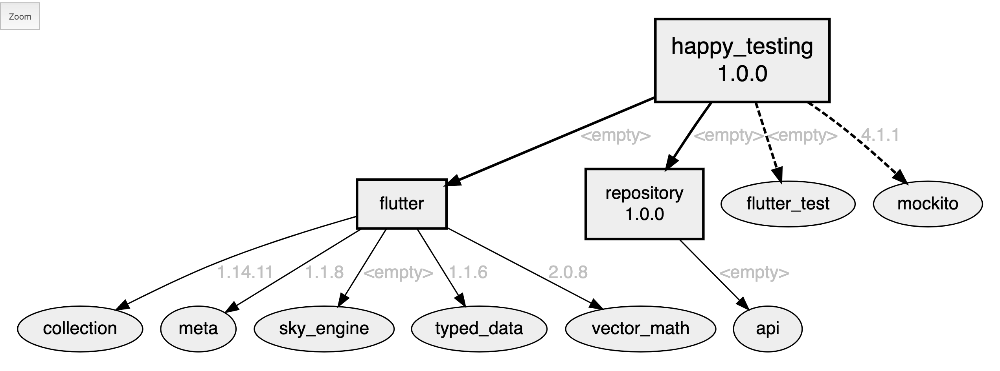

# happy_testing

A Flutter project to showcase different Flutter testing techniques.

## Unit Tests

### Dependency graph

To get a dependency graph of your application:

```sh
pub global activate pubviz
pubviz open -d
```



### Api

To run unit tests and generate a coverage report for the `api` package run:

```sh
cd packages/api
pub run test_coverage && genhtml -o coverage coverage/lcov.info
```

View the coverage report via:

```sh
open coverage/index.html
```

### Repository

To run unit tests and generate a coverage report for the `repository` package run:

```sh
cd packages/repository
pub run test_coverage && genhtml -o coverage coverage/lcov.info
```

View the coverage report via:

```sh
open coverage/index.html
```

## Widget Tests

To run widget tests and generate a coverage report for the flutter app run:

```sh
flutter test --coverage && genhtml -o coverage coverage/lcov.info
```

View the coverage report via:

```sh
open coverage/index.html
```

## Integration Tests

To run integration tests for the flutter app run:

```sh
flutter drive --target=test_driver/main.dart
```

MIT License

Copyright (c) 2020 Very Good Ventures

Permission is hereby granted, free of charge, to any person obtaining a copy
of this software and associated documentation files (the "Software"), to deal
in the Software without restriction, including without limitation the rights
to use, copy, modify, merge, publish, distribute, sublicense, and/or sell
copies of the Software, and to permit persons to whom the Software is
furnished to do so, subject to the following conditions:

The above copyright notice and this permission notice shall be included in all
copies or substantial portions of the Software.

THE SOFTWARE IS PROVIDED "AS IS", WITHOUT WARRANTY OF ANY KIND, EXPRESS OR
IMPLIED, INCLUDING BUT NOT LIMITED TO THE WARRANTIES OF MERCHANTABILITY,
FITNESS FOR A PARTICULAR PURPOSE AND NONINFRINGEMENT. IN NO EVENT SHALL THE
AUTHORS OR COPYRIGHT HOLDERS BE LIABLE FOR ANY CLAIM, DAMAGES OR OTHER
LIABILITY, WHETHER IN AN ACTION OF CONTRACT, TORT OR OTHERWISE, ARISING FROM,
OUT OF OR IN CONNECTION WITH THE SOFTWARE OR THE USE OR OTHER DEALINGS IN THE
SOFTWARE.

```

```
